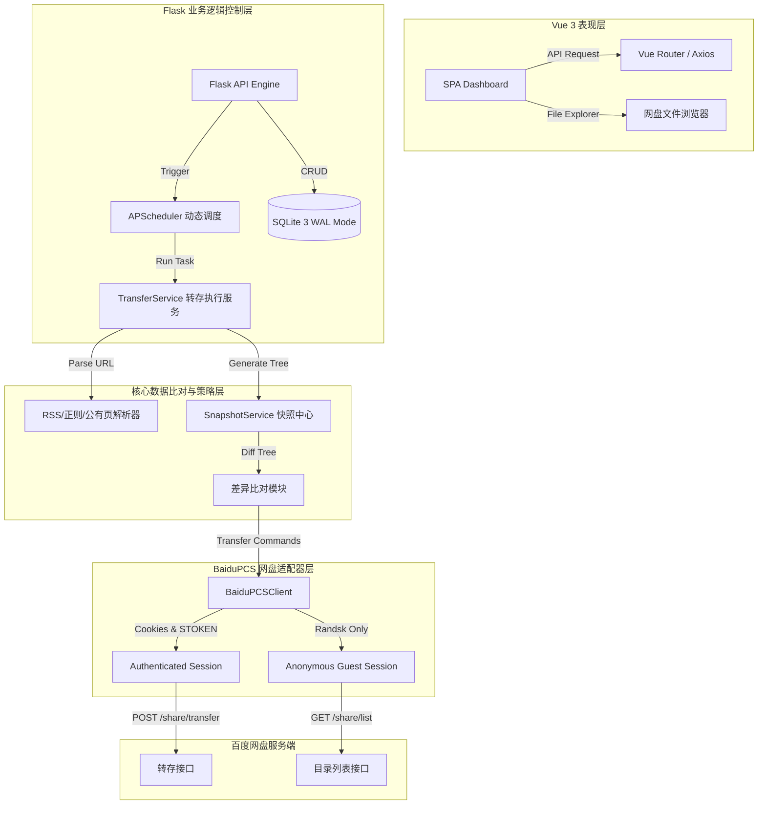

# PanSave 🚀

[](https://www.python.org/)
[](https://vuejs.org/)
[](#)
[](LICENSE)
[](#)

**PanSave** 是一款工业级、跨平台的**网盘订阅与自动差异转存系统**。系统通过对 RSS 提要、网页正则、公有分享链接等数据源的实时监测，计算云端资源与目标存储目录的文件树差异，并结合事务性回滚机制，实现安全、极速的自动差异备份。

---

## 📐 系统架构与数据流拓扑

系统采用前后端分离的单机/集群双适应架构。整体数据流向如下所示：



---

## 🛠️ 转存策略核心差异矩阵

系统针对不同的备份需求，设计了四种不同精细度的转存策略：

| 策略名称 | 增量比对 | 网盘物理文件变化 | 历史备份支持 | 失败事务回滚 | 适用场景 |
| :--- | :--- | :--- | :--- | :--- | :--- |
| **仅通知 (notify_only)** | 仅计算差异 | 🔴 无变化 | 🔴 无 | 🔴 无 | 仅用于新资源发布时的邮件/消息推送提醒 |
| **增量同步 (incremental)** | 🟢 仅转存新增/修改项 | 🟢 文件覆盖/备份原版 | 🟢 备份旧文件 | 🔴 无 | 追踪大文件目录更新，节约存储空间与额度 |
| **版本归档 (version_archive)**| 🟢 整体克隆 | 🟢 创建新时间戳目录 | 🟢 完整多版本 | 🔴 无 | 追踪周期性发布的课程、软件、备份集 |
| **安全覆盖 (safe_overwrite)** | 🟢 整体替换 | 🟢 完整原子性替换 | 🟢 历史备份归档 | 🟢 100% 自动回滚 | 核心线上文件目录、必须保持单路径版本唯一性 |

---

## ✨ 核心优化与技术实现

### 1. 游客 Session 隔离机制（杜绝重定向与 `-7` 报错）
在百度网盘的防爬虫风控中，带着用户的登录凭证 `BDUSS` 去访问其他用户的公有分享详情页及 `/share/list` 目录接口，容易触发安全风控，导致 `Too Many Redirects` 循环或返回 `-7`（权限错误）。
* **成熟设计**：PanSave 内部将 `BDUSS` 会话与游客会话彻底剥离。利用不含任何凭证的匿名 `share_session` 抓取目录，并在提取码验证通过后将获取的 `randsk` 写入该匿名会话；获取目录树结构后，将 `randsk` 更新到主会话中完成 `transfer`。

### 2. 快进检测（Fast-path Match）与 0 I/O 校验
为了降低在频繁定时扫描中对数据库造成的额外写入消耗，系统引入了哈希快速比对机制。
* **成熟设计**：每次抓取远程文件树后，通过排列并哈希所有子文件的元数据算出一个代表全树的 `tree_hash`。若与订阅表中的 `last_snapshot_hash` 一致，说明资源无变化，直接走快进分支退出，**数据库零写入，不加载历史记录，极大地减轻了磁盘负担**。
* **重置机制**：当用户修改过滤正则、目标路径或转存策略时，系统会自动将 `last_snapshot_hash` 重置为 `NULL`，强制下一次扫描进行全量物理比对。

### 3. 高安全与事务一致性
* **原子覆盖机制**：在执行 `safe_overwrite` 时，遵循严格的阶段事务：
  1. 先将资源转存至隐藏缓存区 `.pansave/staging/`。
  2. 递归检索 staging 中的文件数量，执行完整性哈希校验。
  3. 校验通过后，将目标主目录重命名备份至 `.pansave/backup/`。
  4. 将 staging 重命名部署为目标主目录。
  5. 期间如有任一步骤发生网盘报错（如容量不足、连接中断），**立即触发逆向事务回滚，将备份目录还原**，发出警报报告。

### 4. 非阻塞日志队列
* **架构**：由于 SQLite 的并发写限制，传统的同步日志处理器会在并发写库时遭遇死锁或造成日志丢帧。
* **成熟设计**：Loguru 拦截的日志仅被非阻塞式地推入内存的 `Queue` 队列，系统后台维护一个单一的常驻守护线程 `DBLogWorkerThread` 进行串行化入库。若遇锁竞争则执行指数退避重试，保障写库零开销、零丢帧、零死锁。

---

## 🚀 部署与开发指南

### 1. 本地开发调试

#### 后端 Flask API
```bash
# 1. 创建虚拟环境并激活
python -m venv .venv
source .venv/bin/activate  # Windows: .venv\Scripts\activate

# 2. 安装依赖包
pip install -r requirements.txt

# 3. 运行本地开发服务
python web_app.py
```

#### 前端 Vue 3 App
```bash
cd frontend

# 1. 安装开发依赖
npm install

# 2. 运行本地热重载开发服务器
npm run dev
```

### 2. 独立应用打包 (EXE Build)
我们编写了完善的一键式打包构建工具，通过合并前后端静态文件并剔除冗余依赖，能构建出仅几十 MB 且内嵌 Vue 静态资源和 Python 全套服务的 Windows 独立 EXE。

```bash
# 进入前端，编译生成静态资源
cd frontend
npm run build

# 返回根目录，执行 PyInstaller 封包
cd ..
python desktop/build.py
```
构建出的应用位于 `dist/web_app.exe`。

---

## 🔒 安全与合规性声明
* **数据加密**：本地数据库存储的用户账号 Cookie、密码均通过首次启动时配置的管理员密码利用 PBKDF2 动态派生的密钥进行 Fernet 对称加密保护。
* **日志脱敏**：系统在将任何日志输出至控制台、日志文件或 SQLite 数据库前，均会通过正则过滤器（Masking Filter）将 `BDUSS`、`STOKEN`、`pwd` 等所有敏感凭证进行星号星号屏蔽（如 `BDUS***...***`），确保即使分享运行日志也不会泄露敏感数据。
